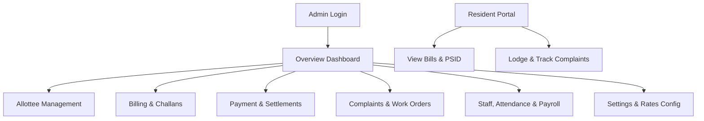
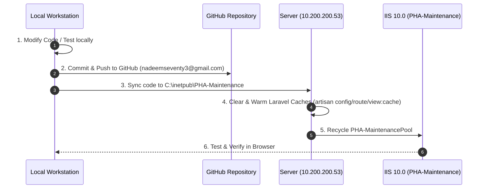

# PHA-Maintenance System — Comprehensive User & Operations Guide

---

## Part 1: System User Guide

### 1. Accessing the System
* **Client Access URL:** `https://10.200.200.53:8082`
* **Admin Login URL:** `https://10.200.200.53:8082/login`
* **Resident / Allottee Portal:** `https://10.200.200.53:8082/portal`
* **Network Requirement:** Connected to the PHA Intranet (`10.200.200.x` subnet or authorized VPN).
* **Browser Requirement:** Microsoft Edge, Google Chrome, Mozilla Firefox, or Safari.

---

### 2. Main Navigation & Core Modules



#### 📊 1. Overview Dashboard (`/dashboard`)
* **KPI Metric Cards:** Displays Total Allottees, Total Billed Amount, Total Collected Amount, Outstanding Arrears, and Collection Recovery Rate (%).
* **Category Breakdown:** Real-time billing and recovery analytics categorized by apartment types (Cat-A, Cat-B, Cat-C, Cat-D, Cat-E).
* **Defaulter Analytics:** Identifies top defaulters and aging arrears (>30, >60, >90 days).
* **Project Switcher:** Switch between PHAF I-16/3 and other configured projects seamlessly.

#### 👥 2. Allottee Management (`/allottees`)
* **Search & Filter:** Find allottees instantly by Name, CNIC, Apartment/Flat Number, Block, or Category.
* **Allottee Profile (`/allottees/{id}`):** Complete history of billing, payment receipts, arrears, and lodged complaints.
* **Ownership Transfer (`/allottees/{id}/transfer`):** Transfer property to a new owner while retaining historical billing integrity and ledger audit logs.
* **Visual Block Navigator (`/blocks/visual`):** Color-coded interactive map of blocks showing occupied, vacant, and payment status per unit.

#### 🧾 3. Billing & Challan Generation (`/monthly-bills`)
* **Monthly Bill Generation (`/monthly-bills/generate`):** Automatically computes monthly maintenance bills based on configured unit sizes and rates.
* **Category-E Billing (`/monthly-bills/category-e`):** Dedicated engine for Category-E commercial/residential units.
* **Challan Printing & Bulk Export (`/bills/bulk-pdf`):** Generates official 3-copy bank challans (Bank Copy, PHA Copy, Allottee Copy) formatted for 1Link / Kuickpay / Over-the-counter bank deposit.

#### 💳 4. Payments & Reconciliation (`/allottees/{id}/payment`)
* **Manual Receipt Entry:** Record bank instrument numbers, bank name, payment date, and amount.
* **PSID / 1Link Status Check:** Query online payment statuses directly via 1Link/1Bill gateway.
* **Bill Settlement (`/monthly-bills/{bill}/settle`):** Mark bills as paid, partial, or advance, automatically updating allottee ledgers in real-time.

#### 🛠️ 5. Complaints & Maintenance Staff (`/admin/complaints`)
* **Complaint Lifecycle:** `Logged` &rarr; `Assigned` &rarr; `In Progress` &rarr; `Resolved` &rarr; `Closed`.
* **Staff Assignment:** Assign plumbing, electrical, civil, or security staff with target SLA dates.
* **Feedback & Escalations:** Track resident ratings and satisfaction notes upon completion.

#### 👷 6. Staff Attendance & Payroll (`/admin/staff/*`)
* **Daily Attendance (`/admin/staff/attendance`):** Mark Present, Absent, Leave, or Half-day.
* **Payroll Processing (`/admin/staff/payroll`):** Generate monthly salary slips based on attendance records, allowances, and deductions.

#### ⚙️ 7. System Settings (`/settings`)
* **Single Source of Truth (SSOT):** Configure maintenance rates per sq. ft. or flat monthly rates, late fee surcharges, and banking parameters. All dashboard metrics, reports, and new bills dynamically read from here.

---

## Part 2: Change Management & Maintenance Guide

If you need to make updates, modify business logic, change rates, or update code, follow the standard lifecycle below:



---

### Procedure 1: Business Logic / Configuration Changes

#### A. Changing Maintenance Rates or Surcharges (No Code Changes Needed)
1. Log in to the Admin Dashboard at `https://10.200.200.53:8082/login`.
2. Navigate to **Settings** (`/settings`).
3. Update the required rate (e.g., Cat-A rate, Cat-E rate, or Late Surcharge %).
4. Click **Save Settings**.
5. *The system will immediately apply updated rates to all subsequent calculations and future bills.*

---

### Procedure 2: Applying Code Updates / Bug Fixes

#### Step 1: Develop and Test Locally
1. Open the project in your local workspace at `C:\My PHA Projects\AI Agentic\Maintenance System-MIS`.
2. Make code edits in controllers, views, or models.
3. Test locally using `php artisan serve` or local test suite.

#### Step 2: Push to GitHub
```powershell
cd "C:\My PHA Projects\AI Agentic\Maintenance System-MIS"
git add .
git commit -m "feat: description of changes"
git push origin main
```

#### Step 3: Deploy to Server (`10.200.200.53`)
Copy updated files to the production directory:
```powershell
# Example: Copying modified controllers or views
Copy-Item -Path "C:\My PHA Projects\AI Agentic\Maintenance System-MIS\app\*" `
          -Destination "\\10.200.200.53\c$\inetpub\PHA-Maintenance\app\" -Recurse -Force

Copy-Item -Path "C:\My PHA Projects\AI Agentic\Maintenance System-MIS\resources\*" `
          -Destination "\\10.200.200.53\c$\inetpub\PHA-Maintenance\resources\" -Recurse -Force
```

#### Step 4: Refresh Laravel Caches & Restart App Pool
Execute on server (or via remote PowerShell):
```powershell
# Refresh Laravel Caches
Set-Location "C:\inetpub\PHA-Maintenance"
C:\xampp\php\php.exe artisan config:cache
C:\xampp\php\php.exe artisan route:cache
C:\xampp\php\php.exe artisan view:cache

# Recycle IIS App Pool
Restart-WebAppPool -Name "PHA-MaintenancePool"
```

---

### Procedure 3: Database Backup & Recovery

#### Creating a Manual Backup:
```powershell
$timestamp = Get-Date -Format "yyyyMMdd_HHmmss"
Copy-Item "\\10.200.200.53\c$\inetpub\PHA-Maintenance\database\database.sqlite" `
          "\\10.200.200.53\c$\inetpub\PHA-Maintenance\database\backups\database_$timestamp.sqlite"
```

#### Restoring from a Backup:
1. Stop App Pool: `Stop-WebAppPool -Name "PHA-MaintenancePool"`
2. Copy backup file over `C:\inetpub\PHA-Maintenance\database\database.sqlite`.
3. Set NTFS Permissions:
   ```powershell
   icacls "C:\inetpub\PHA-Maintenance\database\database.sqlite" /grant "IIS_IUSRS:(I)(M)" /Q
   ```
4. Start App Pool: `Start-WebAppPool -Name "PHA-MaintenancePool"`

---

### Procedure 4: SSL/TLS Certificate Renewal

When the 5-year self-signed certificate expires, or when migrating to a domain name (e.g. `maintenance.pha.gov.pk`):
```powershell
# Generate new certificate
$cert = New-SelfSignedCertificate `
    -DnsName "10.200.200.53", "maintenance.pha.gov.pk", "WIN-M1U3101O5F8" `
    -CertStoreLocation "cert:\LocalMachine\My" `
    -KeyUsage DigitalSignature, KeyEncipherment `
    -Type SSLServerAuthentication `
    -NotAfter (Get-Date).AddYears(5)

# Rebind in IIS
Import-Module WebAdministration
$binding = Get-WebBinding -Name "PHA-Maintenance" -Protocol "https"
$binding.AddSslCertificate($cert.Thumbprint, "My")
Restart-WebAppPool -Name "PHA-MaintenancePool"
```

---

### Quick Reference Checklist

| Task | Action Required | Downtime |
|---|---|---|
| **Rate Change** | Change in `/settings` | 0 seconds |
| **New Staff/User** | Add in `/users` or `/admin/complaints/staff` | 0 seconds |
| **Code Bug Fix** | Copy updated file &rarr; `artisan view:cache` &rarr; Recycle AppPool | ~2 seconds |
| **Database Migration** | `php artisan migrate` on server &rarr; verify integrity | ~5 seconds |
| **Server Reboot** | IIS site and AppPool start automatically (`AutoStart=True`) | System reboot time |
